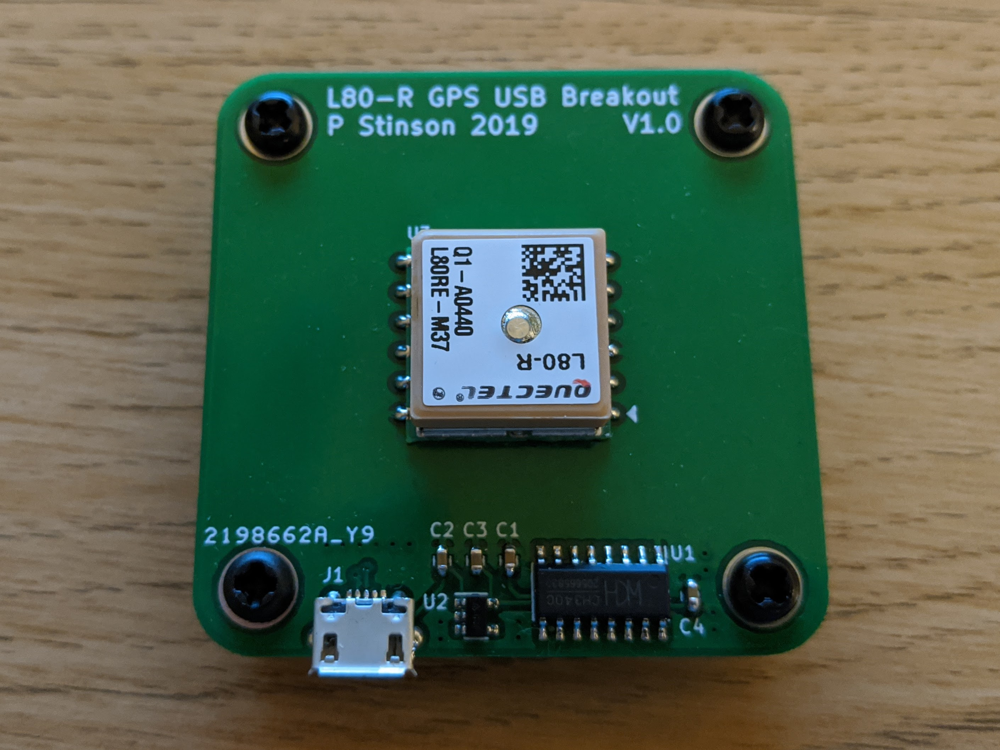
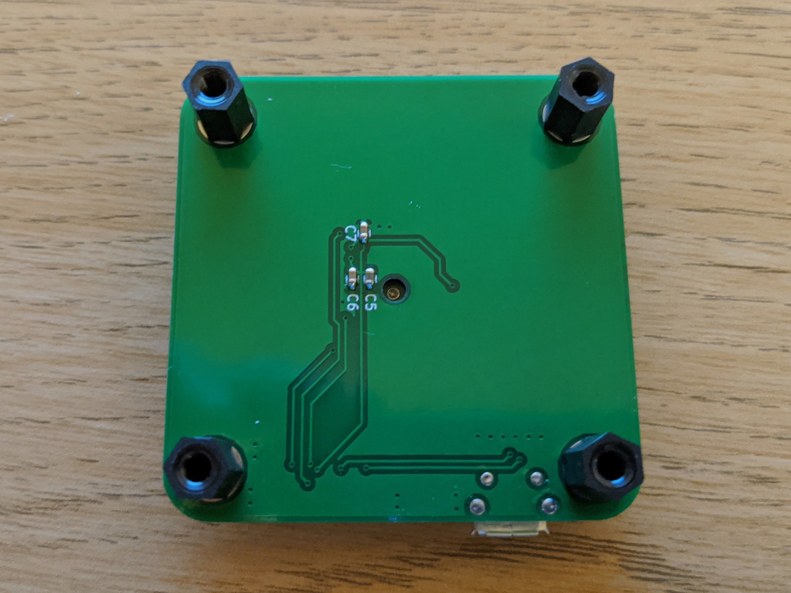

# l80-r-usb-gps
USB GPS board using the Quectel L80-R GPS module

This board makes use of the Quectel L80-R GPS module with integratred ceramic patch antenna and the CH340 USB-to-UART IC, to allow the GPS module to be powered from a micro-USB connector and serial GPS data to be received on a connected computer. A simple python script is included in the repository for receiving the serial data and parsing it to extract speed, time, latitude/longitude etc.

[![CC BY-SA 4.0][cc-by-sa-image]][cc-by-sa]

[cc-by-sa]: http://creativecommons.org/licenses/by-sa/4.0/
[cc-by-sa-image]: https://licensebuttons.net/l/by-sa/4.0/88x31.png
[cc-by-sa-shield]: https://img.shields.io/badge/License-CC%20BY--SA%204.0-lightgrey.svg

This work is licensed under a [Creative Commons Attribution-ShareAlike 4.0 International License][cc-by-sa].
